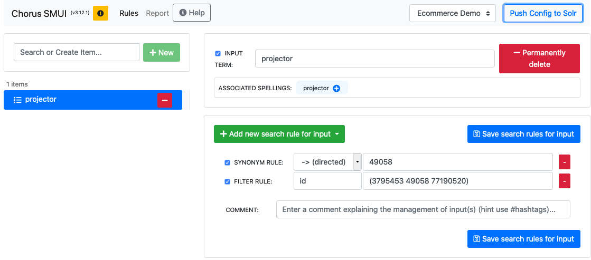
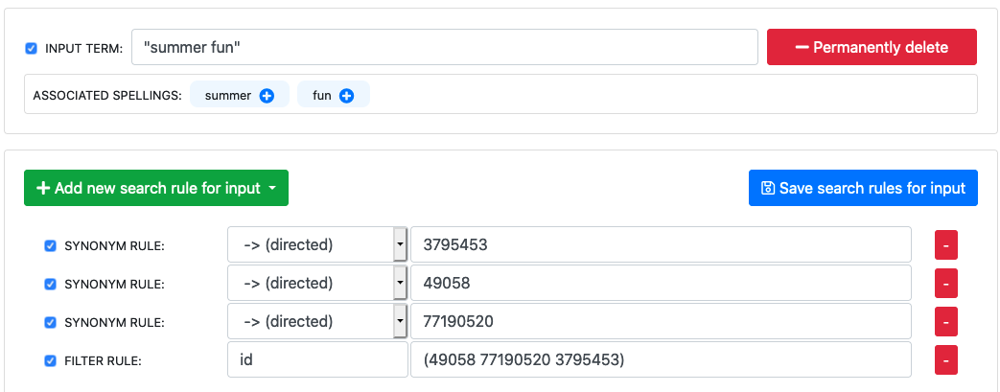
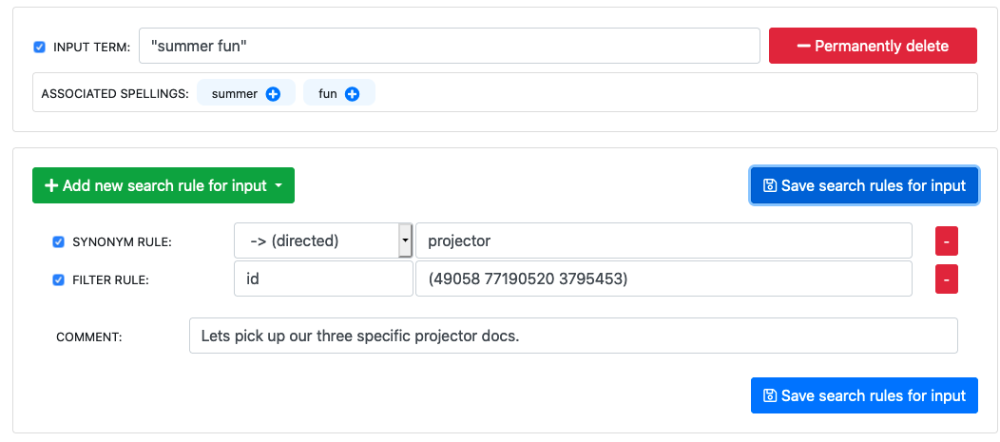

# Fifth Kata: Some days you just KNOW what the right products are for a query!

In this Kata, we're going to learn how to throw all that fancy algorithmic power away, and just manually specify the products to return for a specific search query.    

> The first time I used this approach was in attempting to improve the results for the query 'milk' on a grocery site.   I don't want milk chocolate, I don't want milk of magnesia, indeed, I don't want almond milk.    I want 2% milk followed by whole milk, followed by soy milk and almond milk.   I tried lots of "smart" things, and eventually gave up and hard coded the results!   - Eric Pugh

Visit the web store at http://localhost:4000/ and make sure the drop down has _Default Algo_ next to the search bar selected.   Now do a search for _projector_, and notice that we're getting a lot of accessories for projectors.   While we have learned how to tune this to return fewer accessories to projectors, sometimes you just want to hardcode the specific projectors to return!

We have three specific projectors that we want to return for this query, and they have the `id`'s 49058, 77190520, 3795453:

We're going to talk through three different approaches for curating the search results.

## Filter to a subset of matching documents

This first approach is useful when your query already returns ALL of the specific products that you want as part of a bigger result set.  For example, _projector_ returns ~160 products, including the three projectors.

Open up http://localhost:9000 and you will be in the management screen for SMUI for the _Ecommerce Demo_.

Create a new query for _projector_ and when the spelling versus rules management popup comes, pick the Rules.

Add a `FILTER` rule and specify the field `id`, and then value should be `49058`.

Go ahead and save and publish it, and then go back to Blacklight and search for _projector_ with Querqy enabled: http://localhost:4000/catalog?utf8=%E2%9C%93&view=gallery&search_field=querqy&q=projector.

You should see the _HP vp6110 Digital Projector_ listed as the only product.   

Great, but we want more!

Back into SMUI, and now, change the `FILTER` rule to be a list of products filtered on the `id` field by changing the value to a space delimited list of id's, wrapped in parenthesis:  `(49058 77190520 3795453)`.   Publish the rule and go check it out!

Remember, the logic of a `FILTER` rule is not to go out and get new documents to add to the results, instead it's just to narrow down the results.  So if the product you are filtering on by `id` doesn't exist in the results, then it won't be included.   

## Bringing non matching products into our list to filter

Some times the query that we are optimizing doesn't return our source documents.  Think about if you had a sales campaign for projectors to be used for back yard fun in the summer, and the query you wanted to improve was _summer fun_.   Go ahead and search for summer fun: http://localhost:4000/catalog?q=summer+fun&search_field=default&utf8=%E2%9C%93&view=gallery and you will see some random products that match on the word _fun_.   

In order to bring in our three products, we will use the `SYNONYM` rule to make a connection between _summer fun_ and our various product `id`'s.   We start with creating a rule to match ONLY the query _summer fun_ by wrapping it with quotes in SMUI: `"summer fun"`.

Create a `SYNONYM` rule which is _directed_, i.e with the `-> (directed)` operator, to the first product you want to `49058`.  Repeat this for each of the other product id's.

Now, finish up by including a `FILTER` rule like you did in the previous example.   You are probably wondering WHY you still need to filter by `id`?   The reason is that when we add the unidirectional `SYNONYM`, we will search across ALL of our fields for the values _49058_, _77190520_, _3795453_.   So if any product had that string, say as part of a model number or in the description anywhere, then it will match and be included.   Adding the `FILTER` by the `id` ensures we only match on the three specific products we wanted.

Yes, managing the list of synonym rules is awkward!

## Combining both approaches

If we are lucky enough that there is a single query, like the _projector_ example that covers the set of products we want to filter down to, then we can actually combine the two approaches into a single more manageable set of rules!

Go ahead and map `"summer fun"` to the keyword _projector_ using a unidirectional `SYNONYM` rule.  Then follow up with a filter on the `id` field for the three product ids `(49058 77190520 3795453)`.  

## Summary

The first approach we did was the simplest to think about because we are JUST filtering down a long list of results.

The second approach was good to bring in new products with that don't naturally match a query, though the combination of `SYNONYM` and `FILTER` is a bit awkward to reason about.  Maybe a place to enhance the Query rules?

The third option simplifies things when you need custom searches like _summer fun_ or maybe you have a landing page driven by search where the query would be _landingpage_summer_ and you want to use SMUI to control which products are on the landing page.

Each of these approaches lets you curate your search results, however none of them let you control the sort order.   They are sorted by the natural index order.   If you wanted to sort them, like in the milk example I gave, you would need to have some sort of value like a `popularity` field that then was part of the search query to sort the most popular item to the beginning of the list.   Being able to manually control the sort order might be a good enhancement for the future!

_One more thing, with our Icecat dataset we could have used the [EAN](https://www.hellotax.com/blog/amazon/definitions/ean-number/) numbers for each product instead of the internal `id` which might be easier for a Searchandizer to keep track of._
