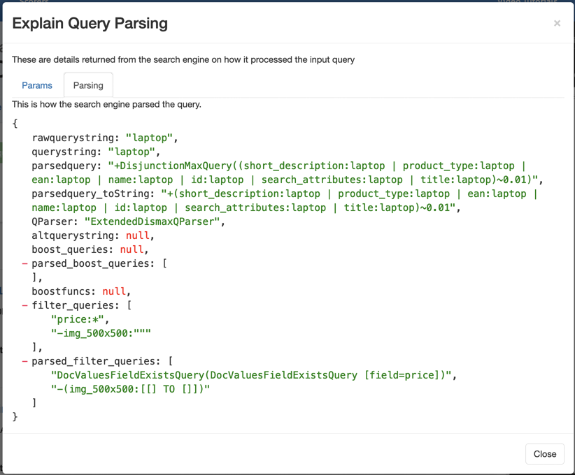

# Seventh Kata: Put a name on an algorithm to gain control!

Once you start working on improving relevancy, you quickly find that you start being buried under a mountain
of different tuning parameters.   The proliferation of different tuning parameters, with all the different variations
of values for the tuning parameters becomes overwhelming, and instead of focusing on the forest, you fixate on the
individual trees of a parameter.   

The way to make sure you aren't fixated on the trees, and focused on the forest is to take a step back and organize
your algorithms.  Once you can give your algorithms a name you can start comparing the different strengths and
weaknesses of the various approaches, and not give twisted into knots of the individual parameters.

The organizing and giving of a name to an algorithm in Solr is supported via ParamSets.   You can learn more about
how these work in Solr via the Ref Guide page: https://solr.apache.org/guide/request-parameters-api.html.

> ParamSets is what Eric calls this, however the Ref Guide calls them Request Parameters.   This is probably one of the most powerful and least used features of Solr ;-).  Thanks Nate for discovering the use of these!

To start using ParamSets you need to think about the various combinations of parameters that you'd like to use. Below
you can see five different ParamSets being configured:

1. `visible_products`: a filter that narrows down to products that have a price AND an image provided.
1. `default_algo`: The most basic algorithm that uses edismax to query over a set of attributes.
1. `mustmatchall_algo`: Generally in ecommerce search you want to increase precision by matching all tokens in the query, this algorithm forces this with a must match of 100%.
1. `querqy_algo`: This is the Querqy Live environment configuration with a standard set of fields.
1. `querqy_algo_prelive`: Same as `querqy_algo` except different set of rewriters that are meant for previewing your rules.   See Kata 008 for more info.


```sh
curl --user solr:SolrRocks -X POST http://localhost:8983/solr/ecommerce/config/params -H 'Content-type:application/json'  -d '{
  "set": {
    "visible_products":{
      "fq":["price:*", "-img_500x500:\"\""]
    }
  },
  "set": {
    "default_algo":{
      "defType":"edismax",
      "qf": "id name title product_type short_description ean search_attributes"
    }
  },
  "set": {
    "mustmatchall_algo":{
      "deftype":"edismax",   
      "mm":"100%",
      "qf": "id name title product_type short_description ean search_attributes"
    }
  },
  "set": {
    "querqy_algo":{
      "defType":"querqy",
      "querqy.rewriters":"replace,common_rules,regex_screen_protectors",
      "querqy.infoLogging":"on",
      "qf": "id name title product_type short_description ean search_attributes"
    }
  },
  "set": {
    "querqy_algo_prelive":{
      "defType":"querqy",
      "querqy.rewriters":"replace_prelive,common_rules_prelive,regex_screen_protectors",
      "querqy.infoLogging":"on",
      "qf": "id name title product_type short_description ean search_attributes"
    }
  },    
}'
```

By picking a algorithm in the web shop front end, you specify which ParamSet to use and therefore
which parameters to run as part of the search.  What is great is that we keep all of the logic related to the
relevancy algorithms in the search engine, and don't have it sprawled all through the front end.

## What about the `visible_products`?

The `visible_products` isn't a relevancy algorithm, instead it's a filtering mechanism to only show valid
products on the web shop.  We combine it with the four relevancy algorithms via the end point used by the web shop
by specifying it via the `useParams` parameter in the `/blacklight` request handler definition configured in
`solrconfig.xml`:

```xml
<!-- Used by the Blacklight Front End App -->
<requestHandler name="/blacklight" class="solr.SearchHandler" useParams="visible_products">
```  

## Using ParamSets with Quepid

Go ahead and set up a new case in Quepid, http://localhost:3000.   Log in as `admin@choruselectronics.com` with
the password `password`.  Create a new case with the name `Algo Comparisons` and then point it at
our Solr:

* http://localhost:8983/solr/ecommerce/select


On the `How Should We Display Your Results?` screen we can customize what information we want to use:  

* Title Field: `title`
* ID Field: `id`
* Additional Display Fields: `thumb:img_500x500, name, brand, product_type, short_description`

Add a simple test query `notebook` and then run the query.  Since we are using the raw `/select` end point,
we are showing ALL the products, we aren't applying the `visible_products` filter by default.  You should see
13104 products being returned.   Now, modify the Query Sandbox to append the `visible_products` filter:

```
q=#$query##&useParams=visible_products
```

Rerun the searches and you'll see the results found drops to 720.  The Icecat dataset has a lot of junky products
without prices or images!

Now let's import our basic rated data set.  Click `Import` and import from `katas/Broad_Query_Set_rated.csv`, making sure to clear the existing `notebook` query.

This dataset is using a graded 0 to 3 scale, so pick the `nDCG@10` scorer via `Select Scorer` screen.

You should now have a overall QScore of __.64__.   You *may* see some Frog icons, they indicate where we are missing some ratings.  Ideally, to have 100% confidence of the scores, you would want every document to be rated, and therefore no Frogs!

Let's run each of the four relevancy algorithms by appending the ParamSet name, and then clicking `Rerun My Searches!`.  

```
q=#$query##&useParams=visible_products,default_algo
```

After you get the score back, double click the `Try` label and give it a proper name to distinguish it.  So if you have
`Try 2`, double click it and rename it `Default Algo`.

At the end, if you bring up the `History` you will see your various tries:


You can use this view to flip back and forth and see the differences.   The basic scores should be:
          
| Algorithm | Score |
| --------- | ----- |
| Default Algo | .64 |
| MM All | .62 |
| Querqy | .63 |
| Querqy Prelive | .63 |

Interestingly you can see that the default algorithm scores the best, beating the "Must Match" that you might think of as a more precise algorithm.  And the Querqy options don't appear to do any better.  But remember that we haven't
done any Active Search Management by creating rules.  

Some good queries for improving with some rules are:
* `head set` versus `headset`
* `smart watch` versus `smartwatch`
* `gaming pc`


## Curious how to understand what is happening with the ParamSet?

A potential reason to not use ParamSets is that it is another layer of indirection between you and your query.
There are two ways that you can understand what a ParamSet like the `mustmatchall_algo` actually does when doing your relevance engineering.  The first is to go directly against Solr:

* http://localhost:8983/solr/ecommerce/config/requestHandler?componentName=/select&expandParams=true&useParams=mustmatchall_algo

However, the second more user friendly way is to open up a specific Query and then click `Explain Query` which
will bring up a view of all the parameters that actually are used to generate the query:


And you click the `Parsing` tab and see how the query was crafted from those parameters:


