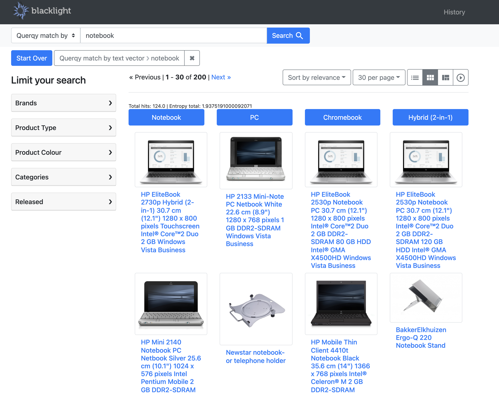

# Twelfth Kata: Vector Search


## Understanding Vector Search

Let's dive into Vector Search!

What we refer to as "vector search" is also known as "neural search", or "dense vector search", or sometimes "cognitive search", among other names.
There are two types of vector representation : Sparse Vectors and Dense Vectors.

In traditional search, we use inverted index for searching through the content of documents. We can understand an inverted index as a derivative of a sparse vector model of N dimensions, where N is the size of the vocabulary (after stemming, removing stopwords etc.).
Each dimension/axis represents a token in the index and each document is represented by an embedding or a vector of a 1 or a non-zero whole number (e.g. term frequency) for the token present in the given document, or 0 when missing. 
This representation is very efficient for searching but only cares for if a token is present or not present in the document. It fails to capture the relationship between these tokens.
For example :
"iphone with a screen guard" vs "screen guard for iphone" may often be seen as same things (as they are composed of the same token) in the sparse vector world, but they're not.

Dense vectors in contrast to sparse vectors, are different, in the sense that all the numbers in the vector are more often "filled in", and not set to be zero. They still have a high number of fixed dimensions (based on the chosen model), but unlike sparse vector, each dimension represents a more meaningful feature to capture the semantic meaning of the content encoded and hence are more complex and use more memory.

Another major advantage using dense vectors is that these can be generated for not only text but also for images , audio and videos too.

The main take away is that things that are similar to each other (in some way or other, at least), end up getting number combinations in the vector space that are quite similar to each other, and things that are totally different and "far away" or "dissimilar" (to a chosen item) will have very different number combinations.

When used in the search context, we are trying to find documents, products, objects, things that match the query text, or give an extra boost to documents that are deemed to be close to your query, mathematically speaking, in terms of distance similarity.  In the case of image vectors, we are trying to match the query text to the images of products (labeled/not labelled with text), or boost items that have images that are found to be nearby in the vector space to the search query.
We will also showcase this using the relevant examples in this kata.


## Checkout quickstart.sh to see how vector search is set up in Chorus.

Let's take a look at the `quickstart.sh` script and find out that we enable chorus to run with vectors by using an additional argument `-vector`.  
As below :

```bash
quickstart.sh -vector
```
 
Doing this will make sure that the setup for vector search is run as Chorus starts up.

To efficiently run Chorus with Vectors, we recommend you assign at least 10GB to your docker to support additional services and operations required, this is also configured as part of the quickstart script already as below:

```bash
if $vector_search; then
  docker_memory_allocated=`docker info --format '{{json .MemTotal}}'`
  echo "Memory total is ${docker_memory_allocated}"

  if (( $docker_memory_allocated < 10737418240 )); then
    docker_memory_allocated_in_gb=$((docker_memory_allocated/1024/1024/1024))
    log_red "You have only ${docker_memory_allocated_in_gb} GB memory allocated to Docker, and you need at least 10GB for vectors demo."
  fi
fi
```


Also, notice that this also triggers an additional 'embedding service' based on [FastApi](https://fastapi.tiangolo.com/) to facilitate query-time embedding generation :

```bash
if $vector_search; then
  log_major "Setting up Embeddings service"
  docker-compose up -d --build embeddings
  ./embeddings/wait-for-api.sh
fi
```

Another block of the script runs `./solr/index-vectors.sh`.

```bash
if $vector_search; then
  # Populating product data for vector search
  log_major "Populating products for vector search, please give it a few minutes!"
  ./solr/index-vectors.sh
```

`index-vectors.sh` ensures that the dataset with preprocessed product vector json files are downloaded from s3 and posted to Solr using `curl`.

The code to generate the product dataset vectors can be found in the `data-encoder` directory.
The documentation for the same can be found in the separate `README.md` in the directory. 


Back to `quickstart.sh`, notice the embeddings re-writers, to ensure embeddings generated as needed. To query text vector field - the query vector is generated using `minilm` and hence is requested from `http://embeddings:8000/minilm/text/`.
To query image vector field, the query vector is generated using `clip` and hence is requested from `http://embeddings:8000/clip/text/`.


```bash
if $vector_search; then
  # Embedding service for vector search
  log_major "Preparing embeddings rewriter."

  curl --user solr:SolrRocks -X POST http://localhost:8983/solr/ecommerce/querqy/rewriter/embtxt?action=save -H 'Content-type:application/json'  -d '{
    "class": "querqy.solr.embeddings.SolrEmbeddingsRewriterFactory",
           "config": {
               "model" : {
                 "class": "querqy.embeddings.ChorusEmbeddingModel",
                 "url": "http://embeddings:8000/minilm/text/",
                 "normalize": false,
                 "cache" : "embeddings"
               }
           }
  }'

  curl --user solr:SolrRocks -X POST http://localhost:8983/solr/ecommerce/querqy/rewriter/embimg?action=save -H 'Content-type:application/json'  -d '{
    "class": "querqy.solr.embeddings.SolrEmbeddingsRewriterFactory",
           "config": {
               "model" : {
                 "class": "querqy.embeddings.ChorusEmbeddingModel",
                 "url": "http://embeddings:8000/clip/text/",
                 "normalize": false,
                 "cache" : "embeddings"
               }
           }
  }'
fi
```

We have leveraged [Paramset](https://solr.apache.org/guide/solr/latest/configuration-guide/request-parameters-api.html) and [Querqy Rewriter](https://github.com/querqy/querqy-embeddings-rewriter) which defines vector enabled relevancy algorithms. 
There are 4 of them : 
1. Match by Text Vector (`querqy_match_by_txt_emb`)
2. Match by Image Vector (`querqy_match_by_img_emb`)
3. Boost by Text Vector (`querqy_boost_by_txt_emb`)
4. Boost by Image Vector (`querqy_boost_by_img_emb`)

```bash
if $vector_search; then
  log_minor "Defining Vector enabled relevancy algorithms using ParamSets."

  curl --user solr:SolrRocks -X POST http://localhost:8983/solr/ecommerce/config/params -H 'Content-type:application/json'  -d '{
    "set": {
      "querqy_boost_by_img_emb":{
        "defType":"querqy",
        "querqy.rewriters":"embimg",
        "querqy.embimg.topK": 100,
        "querqy.embimg.mode": "BOOST",
        "querqy.embimg.boost": 10000,
        "querqy.embimg.f": "product_image_vector",
        "qf": "id name title product_type short_description ean search_attributes",
        "querqy.infoLogging":"on",
        "mm" : "100%"
      }
    },
    "set": {
      "querqy_match_by_img_emb":{
        "defType":"querqy",
        "querqy.rewriters":"embimg",
        "querqy.embimg.topK":100,
        "querqy.embimg.mode": "MAIN_QUERY",
        "querqy.embimg.f": "product_image_vector",
        "qf": "id name title product_type short_description ean search_attributes",
        "querqy.infoLogging":"on",
        "mm" : "100%"

      },
      "querqy_boost_by_txt_emb":{
        "defType":"querqy",
        "querqy.rewriters":"embtxt",
        "querqy.embtxt.topK": 100,
        "querqy.embtxt.mode": "BOOST",
        "querqy.embtxt.boost": 10000,
        "querqy.embtxt.f": "product_vector",
        "qf": "id name title product_type short_description ean search_attributes",
        "querqy.infoLogging":"on",
        "mm" : "100%"
      },
      "querqy_match_by_txt_emb":{
        "defType":"querqy",
        "querqy.rewriters":"embtxt",
        "querqy.embtxt.topK":100,
        "querqy.embtxt.mode": "MAIN_QUERY",
        "querqy.embtxt.f": "product_vector",
        "qf": "id name title product_type short_description ean search_attributes",
        "querqy.infoLogging":"on",
        "mm" : "100%"
      }
    },
  }'
fi
```

In the Chorus webshop we have an explicit dropdown listing these 4 relevancy algorithms that you can use to try out different flavours of pure or hybrid vector search. 
They are listed as below :


Let's go ahead and try some queries like `notebook` , visit the web store at http://localhost:4000/ and make sure the dropdown has `Default Algo` next to the search bar selected.   
Now do a search for `notebook`, and notice that we're getting a lot of accessories for notebook aka laptop.


We have learnt to fix this using Querqy in [Kata5](chorus/katas/005_curating_specific_products_for_a_query.md). Now let's look at how the results change using vectors!

Let us now select `Query match by text vector` from the algorithm dropdown and search again. You'll notice the results already improved fetching the most related notebook aka laptop in the search results.


Next let's select `Query match by image vector` from the algorithm dropdown and search again. Notice the results fetching the actual notebooks in the search results, which are certainly relevant to our query.


The example seen above with Text and Image vectors are pure vector search. Let us now explore the hybrid search algorithms.

Select `Query boost by text vector` from the algorithm dropdown and repeat the search for `notebook`. You'll notice the due to the boost on text vector field we got the hybrid of BM25 + vector based results.


Lastly select `Query boost by image vector` from the algorithm dropdown and repeat the search for `notebook`. You'll notice the result set to contain notebooks and the laptops. 


We hope this Kata may have helped you get deeper understanding of Vector Search , different ways it could be exposed in an e-commerce search engine and getting it up and running in Chorus.

We also recommend you checking out our blogs for further info :
1. [https://opensourceconnections.com/blog/2023/03/15/revolutionizing-e-commerce-search-with-vectors/](https://opensourceconnections.com/blog/2023/03/15/revolutionizing-e-commerce-search-with-vectors/)
2. [https://opensourceconnections.com/blog/2023/03/22/building-vector-search-in-chorus-a-technical-deep-dive/](https://opensourceconnections.com/blog/2023/03/22/building-vector-search-in-chorus-a-technical-deep-dive/)

